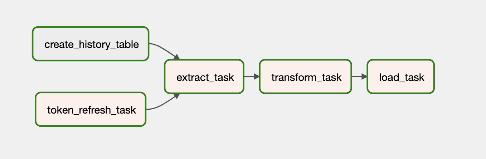
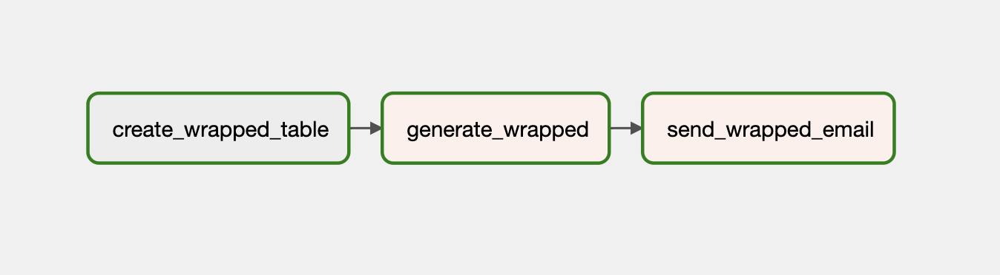

# weekly

ETL workflow for daily ingestion of data


Weekly uses the Spotify API to pull your playing history and generates a weekly wrapped sent directly to your email. The system is implemented using Python, Airflow and Docker.

1. Flask App : For authorizing weekly to access your spotify history
2. Airflow : Run daily ETL jobs to load data to postgres and a weekly job to generate wrapped

ETL workflow for daily ingestion of data



Flow for generating wrapped and sending email




## Setup Instructions

```bash
# initialize docker compose
docker-compose up airflow-init

docker-compose up
```

- Add connection entry in airflow for postgres
- Add API keys to Variable entries
    - EMAIL_API_KEY - sendgrid
    - REFRESH_TOKEN - spotify
    - BEARER_TOKEN - spotify
- Run DAG’s from the UI at [localhost:8080](http://localhost:8080) , username : airflow password : airflow
